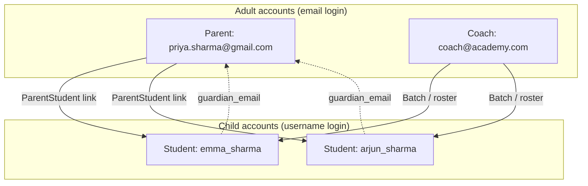
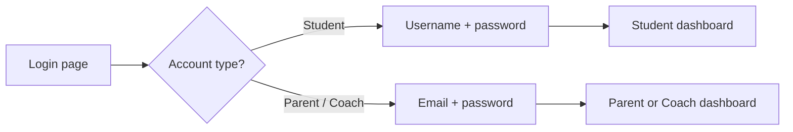
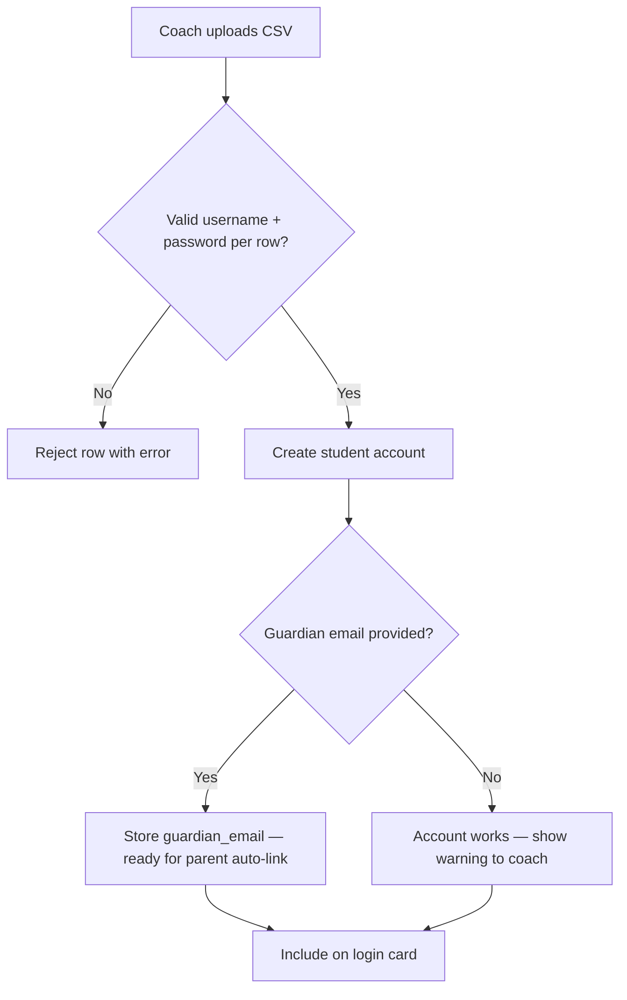

# Parent & Child Account Model — Client Proposal

*Proposal for supporting young students who do not have their own email addresses, aligned with industry practice (ChessKid) and Prodigy Pawns’ existing parent/coach architecture.*

---

## Executive summary

Many children in chess academies **do not have their own email addresses**. They naturally expect to use a **parent’s email** for anything “account-related.” Today, Prodigy Pawns requires a **unique email per user** and uses **email + password** for all logins. That means:

- A parent cannot share their email with a child account.
- A family cannot use one email to log in as both parent and student.
- Onboarding young children creates friction and support burden.

**Recommendation:** Adopt a **ChessKid-style account model**:

1. **Students log in with username + password** (or a simple PIN), not email.
2. **Parent email is stored as “guardian email”** on the child account — for linking, notifications, and password recovery — and **may be shared across multiple children**.
3. **Parents and coaches create child accounts** from their dashboards (including **bulk create** for classrooms).
4. **Child-owned email remains optional** and is never required for login.

This document explains the problem, the reference model, the proposed Prodigy Pawns design, bulk-create behavior, rollout phases, decisions needed from the client, and a **coach training guide** (Section 14) with step-by-step login and signup instructions.

---

## Table of contents

1. [The problem today](#1-the-problem-today)
2. [Real-world scenario](#2-real-world-scenario)
3. [How ChessKid handles this (reference model)](#3-how-chesskid-handles-this-reference-model)
4. [Proposed solution for Prodigy Pawns](#4-proposed-solution-for-prodigy-pawns)
5. [Account types and email fields](#5-account-types-and-email-fields)
6. [User journeys](#6-user-journeys)
7. [Bulk student creation (coach / academy)](#7-bulk-student-creation-coach--academy)
8. [Current vs proposed comparison](#8-current-vs-proposed-comparison)
9. [Phased implementation plan](#9-phased-implementation-plan)
10. [Privacy, safety, and compliance](#10-privacy-safety-and-compliance)
11. [What we do not recommend](#11-what-we-do-not-recommend)
12. [Decisions for the client](#12-decisions-for-the-client)
13. [Appendix: flow diagrams](#13-appendix-flow-diagrams)
14. [Coach training guide: Login, signup & onboarding](#14-coach-training-guide-login-signup--onboarding)

---

## 1. The problem today

### Current behavior in Prodigy Pawns

| Area | Current design |
|------|----------------|
| **Email** | Every user must have a **globally unique** email (`users.email` is unique in the database). |
| **Login** | All users log in with **email + password** only. |
| **Student signup** | Self-service signup creates a **student** account; email must not already exist. |
| **Parent signup** | Parent registers with their own email, then links to **existing** student accounts by entering each child’s **student email**. |
| **Parent ↔ child link** | `parent_students` table links parent user ID to student user ID. |

### Why this breaks down for young children

- A 6-year-old typically **does not have** `emma@gmail.com`.
- Parents often want **one family contact email** (`mom@gmail.com`) for all communications.
- Requiring a unique email per child forces awkward workarounds (e.g. `mom+emma@gmail.com`, fake emails, or duplicate family confusion).
- **One email cannot represent two accounts** (parent + child) under the current login model — login looks up a single user by email and returns one role.

### What families ask

> “Can my child log in with my email?”

**Today:** No — not as both parent and child, and not without a separate unique email per student account.

**After this proposal:** The parent’s email is used for **guardianship and contact**, while the child logs in with a **username** the parent or coach sets up.

---

## 2. Real-world scenario

**The Sharma family**

- Parent: Priya — `priya.sharma@gmail.com`
- Children: Emma (7), Arjun (9) — neither has their own email

**Desired experience**

| Person | Login | Lands on |
|--------|-------|----------|
| Priya (parent) | `priya.sharma@gmail.com` + password | Parent dashboard — progress, payments, class info |
| Emma (student) | `emma_sharma` + simple password/PIN | Student dashboard — puzzles, games, XP |
| Arjun (student) | `arjun_sharma` + simple password/PIN | Student dashboard |

Both children have **guardian email** = `priya.sharma@gmail.com`. Priya’s parent account is **automatically linked** to both children. Priya never needs to “be” Emma or Arjun to check their progress — she uses her own parent login.

---

## 3. How ChessKid handles this (reference model)

ChessKid is the leading kid-focused chess platform. Their model is the industry standard for this problem.

### Two account types (not interchangeable)

| | **Kid account** | **Adult account** (parent / coach / teacher) |
|---|-----------------|-----------------------------------------------|
| **Login** | **Username + password** | **Email + password** |
| **Child’s own email** | Optional (“My Email”) — recovery only | N/A |
| **Parent email on child** | **Guardian Email** — linking & oversight | Same as adult account email |
| **Guardian email used for login?** | **No** | Yes (adult login) |

### Three separate concepts on a kid account

ChessKid deliberately separates:

1. **Username** — what the child types every day to log in.
2. **Guardian email** — parent/coach email for linking, management, and often password reset. **Multiple kids can share the same guardian email.**
3. **My email** (optional) — child’s personal email, if they ever have one. Cannot duplicate guardian email.

> *Source: [ChessKid — How do I connect to my kid’s account through guardianship?](https://support.chesskid.com/en/articles/8863569-how-do-i-connect-to-my-kid-s-account-through-guardianship)*

### Recommended onboarding (ChessKid)

1. Parent creates an **Adult account** with their real email.
2. Parent goes to **My Kids → Add a Kid**.
3. Parent chooses **username + password** for the child. **Child email is not required.**
4. Parent becomes **Primary Guardian** automatically; child appears under **My Kids**.

Coaches can use **Add Multiple Kids** (up to 25 at once) and **Print Login Cards** (name, username, password) for class distribution.

> *Sources: [Add a kid to adult account](https://support.chesskid.com/en/articles/8871815-how-do-i-add-a-kid-to-my-adult-account), [Getting started with ChessKid](https://www.chesskid.com/learn/articles/getting-started-with-chesskid)*

### Linking accounts created separately

If kid and parent signed up independently:

- Set **Guardian Email** on the kid account = parent’s adult account email.
- System **auto-links** when emails match.
- Kids **cannot change** guardian email themselves (security).

### What ChessKid does *not* do

- No single email that logs in as “parent OR child” with a role switcher.
- No requirement that every child have a unique personal email.
- No use of parent email as the child’s daily login identifier.

---

## 4. Proposed solution for Prodigy Pawns

Adopt the same **separation of login identity vs guardian contact**:

### Core principles

1. **Login identity ≠ contact email** for students.
2. **Guardian email** is shared contact info, not a unique login key.
3. **Parents and coaches provision** student accounts; self-signup remains optional for older students.
4. **Parent and student remain separate accounts** with separate credentials and separate progress data.

### Proposed data model changes (summary)

| Field / behavior | Student | Parent | Coach |
|------------------|---------|--------|-------|
| `email` | Optional or internal placeholder; **not used for student login** | Required, unique; used for login | Required, unique; used for login |
| `username` | Required, unique; **primary login for students** | Required, unique | Required, unique |
| `guardian_email` (new) | Parent/coach contact email; **not unique** | N/A | N/A |
| `password` | Required (PIN acceptable for young kids) | Required | Required |
| `ParentStudent` link | Auto-created when parent/coach creates child or when guardian email matches | Existing table | Coach may link via batch/roster |

### Proposed login UX

**Login page — two modes (tabs or toggle):**

| Mode | Fields | Redirect |
|------|--------|----------|
| **I’m a student** | Username + password (or PIN) | `/dashboard` |
| **I’m a parent / coach** | Email + password | `/parent` or `/coach` |

Password reset for students: send link to **guardian email** (or optional student email if set).

---

## 5. Account types and email fields

### Email field matrix

| Field | Who has it | Required? | Unique? | Used for login? | Used for |
|-------|------------|-----------|---------|-----------------|----------|
| **Email** | Parent, coach, admin | Yes | Yes (per account) | Yes | Login, account recovery, notifications |
| **Email** | Student | **No** (proposed) | N/A if absent | **No** | Optional recovery; older self-signup students may keep one |
| **Guardian email** | Student | Recommended | **No** — same parent email on many kids | **No** | Link to parent, password reset, academy notifications |
| **Username** | Student | Yes | Yes | **Yes** | Daily student login |

### Is an email required for a child account?

**No — not for account creation or daily login.**

| Action | Email required for child? |
|--------|---------------------------|
| Parent creates one child | **No** — username + password + guardian email sufficient |
| Coach bulk-creates class roster | **No** — see [Section 7](#7-bulk-student-creation-coach--academy) |
| Child self-signup (optional future path) | Guardian email **yes**; child’s own email **no** |
| Child daily login | **No** — username + password |
| Password reset | Uses **guardian email** (or optional child email) |

### Internal placeholder emails (implementation detail)

If the database today requires a non-null unique `email` on every user row, students without a real email can use an **internal placeholder** that is never shown to users, e.g.:

`emma_sharma@students.prodigypawns.internal`

The **username** remains the real login handle. This is an implementation convenience, not a product requirement shown to families.

---

## 6. User journeys

### Journey A — Parent creates children (recommended default)

1. Priya signs up as **parent** with `priya.sharma@gmail.com`.
2. From **Parent dashboard → Add child**:
   - Child name: Emma
   - Username: `emma_sharma`
   - Password / PIN: (parent chooses)
   - Guardian email: pre-filled with Priya’s email
3. System creates **student** account + `ParentStudent` link.
4. Emma logs in at **Student login** with `emma_sharma` + PIN → student dashboard.
5. Priya logs in at **Parent login** with email + password → sees Emma (and Arjun, etc.) under My Children.

### Journey B — Coach creates class roster (including bulk)

1. Coach creates batch “Saturday Beginners”.
2. Coach uses **Add student** or **Bulk add students** (spreadsheet or form).
3. For each child: first name, last name, username, password; guardian email optional but recommended.
4. Coach prints or exports **login cards** for the first class.
5. When parent later signs up with matching guardian email, accounts **auto-link** (or coach manually links).

### Journey C — Older student self-signup (optional)

1. Student selects “Create student account”.
2. Enters username, password, guardian email (parent’s).
3. Does **not** need own email.
4. Parent signs up later; system links when guardian email matches parent account email.

### Journey D — Password forgotten (child)

1. Child (or parent on their behalf) clicks **Forgot password** on student login.
2. Enters **username**.
3. Reset link sent to **guardian email** on file.
4. Parent resets password from inbox; tells child new PIN.

---

## 7. Bulk student creation (coach / academy)

Bulk create is how academies onboard a full classroom on day one. ChessKid supports **Add Multiple Kids** (2–25 accounts per action) and spreadsheet import where **parent and kid email columns are optional**.

### Proposed bulk create for Prodigy Pawns

**Entry points**

- Coach dashboard → Batch → **Add students → Bulk import**
- CSV upload or in-app grid (similar to ChessKid spreadsheet)

### Required columns per student row

| Column | Required? | Notes |
|--------|-----------|-------|
| First name | Yes | Display / login cards |
| Last name | Yes | Display / login cards |
| Username | Yes | Unique; child’s login. Coach may use suggested format e.g. `firstname_lastname` or `firstname2025` |
| Password | Yes | Can set one default password for all rows, with prompt to change later |
| Guardian email | **Recommended, not required** | Parent contact; enables auto-link when parent registers |
| Student email | **No** | Optional; for older students only |
| Age / gender | Optional | Existing student profile fields |

### Is an email required in bulk create?

| Email type | Required in bulk create? | Purpose |
|------------|--------------------------|---------|
| **Student email** | **No** | Child login uses **username**, not email |
| **Guardian email** | **No** (strongly recommended) | Parent linking, password reset, class announcements. Multiple students can share the same guardian email |

**Short answer for the client:** Bulk create does **not** require any email to create working student accounts. Username + password are sufficient. Guardian email should be collected when possible so parents can be linked and recover passwords without calling support.

### Bulk create workflow (coach)

```
1. Coach opens batch → Bulk add students
2. Upload CSV OR fill grid (up to N students per batch — e.g. 25–50)
3. System validates: unique usernames, password rules
4. System creates student accounts (no student email required)
5. Optional: auto-enroll all in current batch
6. Coach downloads / prints Login Cards:
   ┌─────────────────────────────────────┐
   │  Prodigy Pawns — Emma Sharma        │
   │  Website: app.prodigypawns.com      │
   │  Username: emma_sharma              │
   │  Password: ****                     │
   │  Parent: priya.sharma@gmail.com     │
   └─────────────────────────────────────┘
7. First class: hand out cards; kids log in with username + password
```

### When guardian email is missing in bulk create

Accounts still work. Tradeoffs:

| With guardian email | Without guardian email |
|---------------------|-------------------------|
| Parent auto-links on signup | Parent must be linked manually by coach or support |
| Password reset to parent inbox | Reset via coach admin or support |
| Payment / notification routing | Harder to reach family digitally |

**Recommendation:** Allow bulk create without email, but show a **warning** in the UI: *“3 students have no guardian email — parents won’t auto-link.”*

### Parent onboarding after bulk create (important)

A common question: *“The coach added 10 students with guardian emails — but the parent never created a password. How do they log in?”*

**Answer: guardian email is not a parent login.** It is contact and linking information stored on the child’s account. Parents and children always have **separate accounts** and **separate credentials**.

| Who | Account exists after bulk create? | Can they log in immediately? | What they use |
|-----|-----------------------------------|-------------------------------|---------------|
| **Student (child)** | Yes — coach created it | **Yes** | **Username + password** (from login card) |
| **Parent (guardian)** | **No** — not created yet | **No** | Must **sign up** first, then **email + password** they choose |

#### What guardian email does *before* the parent signs up

- Holds the parent’s contact address on each child record.
- Enables **auto-linking** when the parent later registers with the same email.
- Receives **child password-reset** emails (if that feature is enabled).
- Appears on **login cards** as a reminder (“Parent: mom@gmail.com”).

It does **not** grant access to the parent dashboard and is **not** a password the parent can type on the login screen.

#### Timeline after coach bulk-creates 10 students

```
Day 1 — Coach bulk create
  ├── 10 student accounts created (username + password each)
  ├── Guardian email stored on each row (e.g. mom@gmail.com on 3 siblings)
  └── Coach prints login cards and hands them out in class

Day 1 — Children can play immediately
  └── Each child: Login → Student tab → username + password → student dashboard

Day 1–7 — Parents still need their own account
  └── Parent has NOT logged in yet — no parent account exists

When parent is ready — Parent signup (one time)
  ├── Go to Sign up → Parent
  ├── Email: mom@gmail.com (must match guardian email on children)
  ├── Password: parent chooses their own (e.g. during signup)
  └── System auto-links all children with matching guardian email

After parent signup — Parent can log in anytime
  └── Login → Parent tab → mom@gmail.com + password → parent dashboard
```

#### Proposed: “Invite parent” after bulk create

To reduce confusion, after bulk import the coach dashboard should offer:

- **Send parent invite** (optional email per unique guardian address):  
  *“Your child’s Prodigy Pawns account is ready. Create your parent account here: [link]. Use this email: mom@gmail.com”*
- **Parent signup without listing child emails** — system finds children by matching guardian email (no need to type each child’s username).

#### Edge cases (coach reference)

| Situation | What happens |
|-----------|--------------|
| Parent never signs up | Children still play normally; parent has no dashboard until they register |
| Guardian email typo in CSV | Parent signs up with correct email → no auto-link; coach fixes guardian email or links manually |
| Two children, same guardian email | One parent signup links **both** children automatically |
| Parent already has a parent account | New bulk-created children with matching guardian email auto-link on create (or on parent’s next login) |
| Siblings share one login card mix-up | Each child has a **unique username** — credentials are never shared between students |

### Duplicate guardian emails across rows

**Allowed and expected.** Siblings in the same class often share `mom@gmail.com` as guardian email. This must **not** violate uniqueness — only **username** (and parent/coach **login email**) stay unique.

---

## 8. Current vs proposed comparison

| Topic | Current Prodigy Pawns | Proposed (ChessKid-style) |
|-------|----------------------|---------------------------|
| Student login | Email + password | **Username + password/PIN** |
| Parent login | Email + password | Email + password (unchanged) |
| Student email | Required, unique | **Optional**; not login identifier |
| Parent email on child | N/A (child email was the link key) | **Guardian email** — shared, not unique |
| Parent creates child | No — must link existing student emails | **Yes — Add child** from parent dashboard |
| Coach bulk create students | Not supported for accounts | **Yes — CSV/grid + login cards** |
| Same parent email on 2+ kids | Impossible (email unique per user) | **Yes** via guardian email |
| One email, parent + child login | No | Still **no** — separate accounts, separate logins |
| Password reset for child | To child email | To **guardian email** |

---

## 9. Phased implementation plan

### Phase 1 — Foundation (highest priority)

**Goal:** Young children can log in without their own email.

- Add `guardian_email` to student profiles.
- Student login accepts **username or email** (backward compatible for existing students).
- Relax student email requirement (optional or internal placeholder).
- `authenticate_user` lookup: username for students, email for parent/coach/admin.
- Password reset for students routes to guardian email.
- Update login page: Student vs Parent/Coach tabs.

**Client-visible outcome:** Coach or parent can give a child username + PIN; child can log in.

### Phase 2 — Parent provisioning

**Goal:** Parents manage family accounts without coach involvement.

- Parent dashboard: **Add child** (name, username, password, avatar).
- Auto-create `ParentStudent` link.
- Auto-link when guardian email matches existing parent email on new self-signup students.

**Client-visible outcome:** Parent creates Emma and Arjun from home; no fake emails.

### Phase 3 — Coach bulk create & login cards

**Goal:** Academy day-one onboarding for full classes.

- CSV / grid bulk import into batch.
- Validation report (duplicate usernames, missing guardian email warnings).
- **Print / PDF login cards** export.

**Client-visible outcome:** Coach imports 20 students in one step; hands out cards in class.

### Phase 4 — Polish (optional)

- Profile picker on shared family device (“Who’s playing?”) after parent login.
- Simpler PIN-only UI for ages 5–7 (large buttons, numeric keypad).
- Guardian email verification (confirm parent owns inbox before linking sensitive actions).

---

## 10. Privacy, safety, and compliance

### Why this model is appropriate for minors

- **Minimizes child PII:** No need to collect a child-owned email for core product use.
- **Parent visibility:** Guardian link matches how youth products assign accountability.
- **Separation of roles:** Parents cannot accidentally play rated games “as” the child without the child’s credentials (unless parent resets password — which is intended for young kids).

### Safety patterns to preserve

- Students and parents have **different dashboards and permissions** (already true).
- **Guardian email** on child accounts should not be editable by the child without parent approval (ChessKid locks this).
- Game invites / social features should continue to respect role boundaries (students play students; linked parents oversee).

### Communications

- Class announcements, payment receipts, password resets → **guardian email** and/or parent account email.
- Marketing / legal notices → parent account only.

---

## 11. What we do not recommend

| Approach | Why avoid |
|----------|-----------|
| **Same email for parent and child login** | Ambiguous credentials; one password cannot mean two accounts; breaks password reset |
| **Email + “role picker” after login** | Confusing for kids; merges two security domains |
| **Force every child to have unique email** | High friction; unrealistic for ages 5–10; increases signup drop-off |
| **Plus-address workaround as permanent solution** (`mom+emma@gmail.com`) | Confusing for non-technical parents; not supported by all email providers |
| **Coach shares one class password** | No individual progress, ratings, or assignments; unacceptable for a learning platform |

---

## 12. Decisions for the client

Please confirm or adjust before implementation:

| # | Decision | Options / recommendation |
|---|----------|--------------------------|
| 1 | **Student login identifier** | **Username** (recommended) vs username or student email during transition |
| 2 | **Password format for young kids** | 4–6 digit PIN vs minimum 6-character password |
| 3 | **Self-signup for students** | Keep for older kids with guardian email required? Disable for under-X age? |
| 4 | **Guardian email in bulk create** | Optional but warned (recommended) vs required for bulk import |
| 5 | **Auto-link parent ↔ child** | Auto when guardian email matches parent email (recommended) |
| 6 | **Login cards branding** | PDF template with academy logo for coach handouts |
| 7 | **Bulk import limit** | e.g. 25 per batch (ChessKid) vs 50 per upload |
| 8 | **Existing students** | Keep email login as fallback during migration? |

---

## 13. Appendix: flow diagrams

### A. Account relationships



### B. Login routing



### C. Bulk create — email requirements



---

## 14. Coach training guide: Login, signup & onboarding

*Use this section to train coaches and front-desk staff. It consolidates every login and signup path in one place.*

### 14.1 Quick reference — who logs in with what?

| Role | Sign up? | Log in with | Lands on |
|------|----------|-------------|----------|
| **Student (child)** | Coach/parent creates account, or optional self-signup | **Username + password/PIN** | Student dashboard (`/dashboard`) |
| **Parent** | **Yes** — separate signup required | **Email + password** | Parent dashboard (`/parent`) |
| **Coach** | Invite-only signup | **Email + password** | Coach dashboard (`/coach`) |

**Golden rule for coaches:**  
> **Guardian email on a student record is NOT the parent’s login.**  
> It is the parent’s contact email. The parent must still create their own parent account and password.

**Golden rule for families:**  
> **Children and parents never share one login.**  
> Same family email can appear as guardian email on multiple kids, but each person has their own username or password.

---

### 14.2 Coach playbook: Bulk-create a class (most common)

Use this when onboarding a full classroom before or on day one.

#### Step 1 — Prepare your spreadsheet

| Column | Required? | Example |
|--------|-----------|---------|
| First name | Yes | Emma |
| Last name | Yes | Sharma |
| Username | Yes | `emma_sharma` |
| Password | Yes | `chess123` (or one default for all) |
| Guardian email | Recommended | `priya.sharma@gmail.com` |
| Student email | No | Leave blank for young kids |

Tips:

- Usernames must be **unique** across the whole academy.
- Siblings can share the **same guardian email** — that is expected.
- No email is required for students to be created or to log in.

#### Step 2 — Bulk import in coach dashboard

1. Log in as **coach** (email + password).
2. Open **Batches** → select or create your batch (e.g. “Saturday Beginners”).
3. Click **Add students → Bulk import**.
4. Upload CSV or fill the grid (up to academy limit, e.g. 25–50 per upload).
5. Review validation report:
   - Red = fix before import (duplicate username, missing password).
   - Yellow = warning (missing guardian email — students work, but parents won’t auto-link).
6. Confirm import → student accounts are created immediately.

#### Step 3 — Print and distribute login cards

1. From the batch page, click **Print login cards** (or export PDF).
2. Each card shows:
   - Child’s name
   - Website URL
   - **Username**
   - **Password**
   - Guardian email (for parent reference)
3. Hand one card to each child at the first class.

#### Step 4 — First class: get kids logged in

Tell students:

1. Go to the Prodigy Pawns website.
2. Click **Log in**.
3. Select **I’m a student**.
4. Enter **username** and **password** from the card.
5. They should land on the student dashboard and can start puzzles/games.

**Kids do not need a parent account to play.**

#### Step 5 — Tell parents to create their parent account

After bulk create, parents **do not** have a password yet. Share this script:

> “Your child can log in today with the username and password on their card.  
> To view progress and class info on your phone, create a **parent account** at [signup link].  
> Use **the same email we have on file** (e.g. priya.sharma@gmail.com) and choose your own password.  
> You do **not** need your child’s username — your children will link automatically.”

Optional: use **Invite parent** in the coach dashboard to email this automatically.

#### Step 6 — Parent signs up (one time per family)

1. Parent opens **Sign up → Parent**.
2. Enters:
   - Full name
   - Email (must match **guardian email** on children, e.g. `priya.sharma@gmail.com`)
   - Username (parent account username)
   - Password (parent **chooses** this — coach does not set it)
3. System finds all students with matching guardian email and links them.
4. Parent is redirected to the parent dashboard → **My Children** shows all linked kids.

**Parent does not enter each child’s email or username during signup** (proposed behavior).

---

### 14.3 Coach playbook: Add one student manually

1. Coach dashboard → Batch → **Add student**.
2. Enter first name, last name, **username**, **password**.
3. Enter **guardian email** (recommended).
4. Save → give login card to family.
5. Follow **Step 5** (tell parents to sign up) and **Step 6** (parent signup) in [Section 14.2](#142-coach-playbook-bulk-create-a-class-most-common).

---

### 14.4 Parent playbook: Sign up first, then add children

Recommended for families joining outside a bulk class.

#### Parent signup

1. Go to **Sign up → Parent**.
2. Enter email, username, full name, password.
3. Complete signup → parent dashboard.

#### Add a child (from parent dashboard)

1. Parent dashboard → **Add child**.
2. Enter child’s name, **username**, **password/PIN**, avatar.
3. Guardian email is pre-filled with the parent’s email.
4. Save → child account is created and linked immediately.

#### Child’s first login

1. **Log in → I’m a student**.
2. Username + password the parent set.
3. Student dashboard.

---

### 14.5 Student self-signup (optional — older students)

When self-signup is enabled:

1. Go to **Sign up → Student**.
2. Enter username, full name, password, age, avatar.
3. Enter **guardian email** (parent’s email) — **not** the child’s own email.
4. Child’s own email: **not required**.
5. Parent signs up later with the same email → accounts auto-link.

---

### 14.6 Login steps (all roles)

#### Student login

1. Open Prodigy Pawns → **Log in**.
2. Select tab: **I’m a student**.
3. Enter **username** (not email).
4. Enter **password** or PIN.
5. Click **Log in** → student dashboard.

#### Parent login

1. Open Prodigy Pawns → **Log in**.
2. Select tab: **I’m a parent**.
3. Enter **email** (the one used at parent signup).
4. Enter **password** (the one the parent created at signup — **not** the child’s password).
5. Click **Log in** → parent dashboard.

#### Coach login

1. Open Prodigy Pawns → **Log in**.
2. Select tab: **I’m a coach** (or combined parent/coach tab).
3. Enter **email** + **password**.
4. Click **Log in** → coach dashboard.

---

### 14.7 Forgot password

#### Child forgot password

1. On login page → **Forgot password** (student tab).
2. Enter the child’s **username** (not guardian email).
3. Reset link is sent to **guardian email** on file.
4. Parent opens email, sets new password, tells child the new PIN.

*If no guardian email on file → coach or support must reset from admin tools.*

#### Parent forgot password

1. Login page → **Forgot password** (parent tab).
2. Enter parent **email**.
3. Reset link sent to that email.

#### Coach forgot password

Same as parent — reset via coach account email.

---

### 14.8 Coach FAQ — common questions

| Question | Answer |
|----------|--------|
| “Can the parent log in with the guardian email we entered in bulk create?” | **No.** Guardian email is not a login. Parent must sign up and create their own password. |
| “Can parent and child use the same email to log in?” | **No.** Child uses **username**. Parent uses **email**. They are separate accounts. |
| “We added guardian email — why can’t the parent see the dashboard?” | Parent hasn’t signed up yet. Children can still play. Parent needs one-time parent signup. |
| “Do we need an email for each child in bulk create?” | **No.** Username + password are enough. Guardian email is recommended for parent linking. |
| “Two siblings — one parent email?” | **Yes.** Put the same guardian email on both rows. One parent signup links both. |
| “Can kids play before parents sign up?” | **Yes.** Hand out login cards; student login works immediately. |
| “What do we tell parents who only want to ‘watch progress’?” | “Create a free parent account with your email. Takes 2 minutes. Your kids link automatically.” |
| “Parent used wrong email at signup” | Children won’t auto-link. Coach updates guardian email on student records, or links manually in admin tools. |

---

### 14.9 One-page training checklist for coaches

Print or share this checklist before the first class:

- [ ] Batch created in coach dashboard
- [ ] Students bulk-imported (username + password per child)
- [ ] Guardian email filled where possible
- [ ] Login cards printed — one per student
- [ ] Test one student login yourself before class
- [ ] In class: hand out cards, walk kids through **Student login**
- [ ] Tell parents: “Create your parent account at [URL] with email [guardian email]”
- [ ] Optional: send **Invite parent** emails from dashboard
- [ ] After week 1: follow up with families who haven’t created parent accounts

---

### 14.10 Talking points script (read to parents at pickup / email)

**After bulk class setup:**

> Hi! Your child’s Prodigy Pawns account is ready.  
>  
> **For your child:** Use the login card — username and password on the front. They can start playing today.  
>  
> **For you:** Create a parent account at [website]/signup (choose “Parent”). Use **[guardian email]** and pick any password you’ll remember. You don’t need your child’s username — we’ll link your children automatically.  
>  
> **Remember:** Your child’s password and your parent password are different. Your child logs in with a username; you log in with your email.

---

## References

- ChessKid — [Getting started](https://www.chesskid.com/learn/articles/getting-started-with-chesskid)
- ChessKid — [Add a kid to adult account](https://support.chesskid.com/en/articles/8871815-how-do-i-add-a-kid-to-my-adult-account)
- ChessKid — [Guardianship linking](https://support.chesskid.com/en/articles/8863569-how-do-i-connect-to-my-kid-s-account-through-guardianship)
- ChessKid — [Add existing kid to My Kids](https://support.chesskid.com/en/articles/9210599-adults-how-do-i-add-an-existing-kid-account-to-my-my-kids-list)
- Prodigy Pawns — current auth: `docs/AUTH_DOCUMENTATION.md`
- Prodigy Pawns — parent API: `backend/parent_endpoints.py`, `ParentStudent` model

---

*Document version: 1.1 — added parent onboarding after bulk create (Section 7) and coach training guide (Section 14). Implementation estimates and sprint breakdown can be added once decisions in Section 12 are confirmed.*
